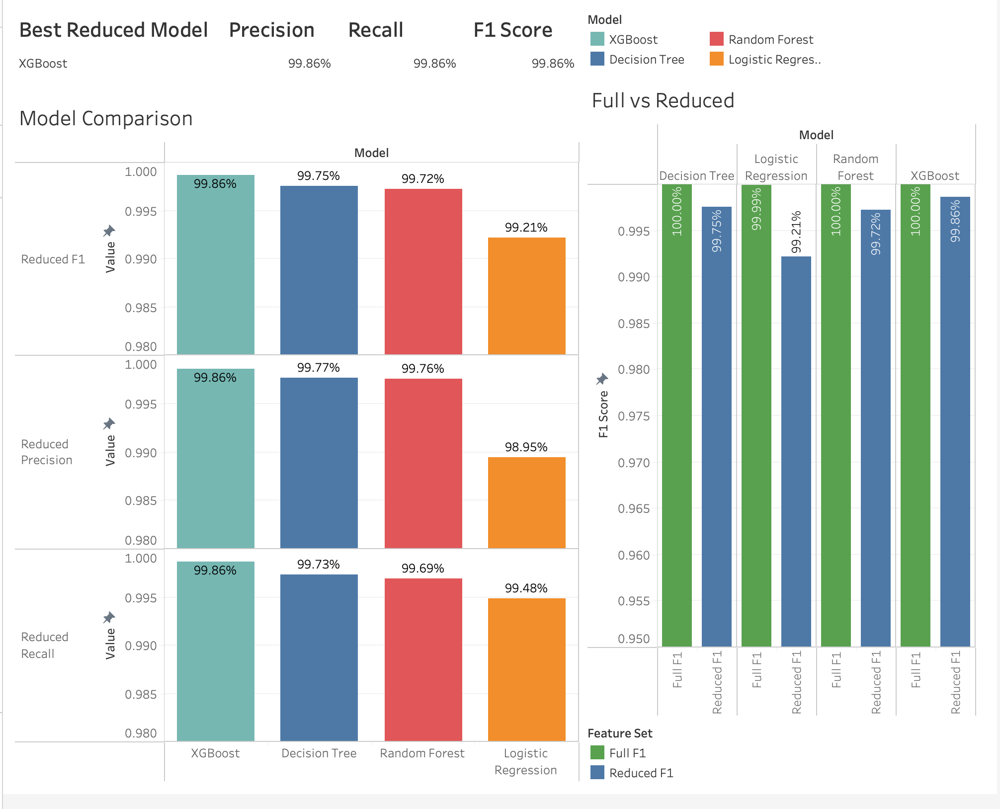

# 🔐 Phishing Website Detection & Risk Analysis

## Overview

This project analyzes website and URL characteristics to identify patterns associated with phishing and uses machine learning to classify websites as **phishing or legitimate**.

The project combines **Python, SQL, machine learning, and Tableau** to explore phishing behavior, compare classification models, and evaluate whether a reduced feature set can maintain strong predictive performance.

---

## Dataset

The project uses the **PhiUSIIL Phishing URL Dataset** from the UCI Machine Learning Repository.

- **235,795 websites**
- **54 features**
- **Binary classification target**
- Approximately **57% legitimate** and **43% phishing**
- No reported missing values

Features include URL and domain characteristics, HTTPS usage, redirects, page structure, forms, external references, and other website behaviors.

For modeling, the target was encoded as:

- `0` — Legitimate
- `1` — Phishing

---

## Tools & Technologies

- **Python** — Pandas, NumPy, Matplotlib
- **SQL / MySQL** — data analysis
- **Scikit-learn & XGBoost** — machine learning
- **Tableau** — dashboards and visualization
- **Jupyter Notebook** — cleaning, EDA, and modeling

---

## Data Cleaning & Analysis

Python was used to inspect and prepare the dataset by checking data types, missing values, duplicates, feature distributions, and class balance.

The cleaned data was then loaded into **MySQL**, where SQL was used to analyze differences between phishing and legitimate websites, including URL characteristics, HTTPS usage, redirects, website behavior, and financial-related indicators.

Further exploratory analysis in Python examined feature distributions, correlations, phishing rates, and relationships between website characteristics and the target.

---

## Machine Learning

Four classification models were trained and compared:

- Logistic Regression
- Decision Tree
- Random Forest
- XGBoost

Models were evaluated using **Accuracy, Precision, Recall, F1 Score, and ROC-AUC**.

Two modeling approaches were tested:

**Full Feature Model** — used the complete set of appropriate predictive features.

**Reduced Feature Model** — used a smaller group of selected features to determine whether strong phishing detection could be maintained with less complexity.

Special attention was given to **phishing recall and false negatives**, since a false negative represents a phishing website incorrectly classified as legitimate.

---

## Key Findings

1. **Phishing and legitimate websites showed clear differences across several URL, domain, and webpage characteristics**, demonstrating that phishing detection benefits from combining multiple types of website information rather than relying on a single indicator.

2. **HTTPS alone was not sufficient to determine whether a website was legitimate.** Although HTTPS usage differed between the two classes, phishing websites can still use HTTPS, making additional URL and webpage characteristics important for detection.

3. **Website structure and behavior provided useful phishing signals**, including characteristics related to redirects, forms, password fields, external references, and other webpage elements.

4. **Tree-based models produced extremely strong phishing classification performance**, outperforming the simpler baseline models and demonstrating the value of nonlinear relationships between website characteristics.

5. **The reduced-feature experiment maintained strong predictive performance despite using fewer inputs**, showing that effective phishing detection did not require every available feature and highlighting the value of feature selection and model simplicity.

---

## Tableau Dashboards

### 📊 Phishing Analysis Dashboard


### 🤖 Machine Learning Performance Dashboard



---

## Project Structure

```text
├── data/
│   ├── raw/
│   ├── cleaned/
│   └── model_outputs/
├── images/
├── notebooks/
│   ├── 01_cleaning.ipynb
│   ├── 02_eda.ipynb
│   └── 03_modeling.ipynb
├── scripts/
│   └── load_to_sql.py
├── sql/
│   └── analysis.sql
├── tableau/
├── requirements.txt
└── README.md
```

---

## Future Improvements

- Test the models on an independent phishing dataset to evaluate generalization
- Explore additional feature-selection techniques
- Optimize the classification threshold to further reduce false negatives
- Deploy the final model through a lightweight web application or API
